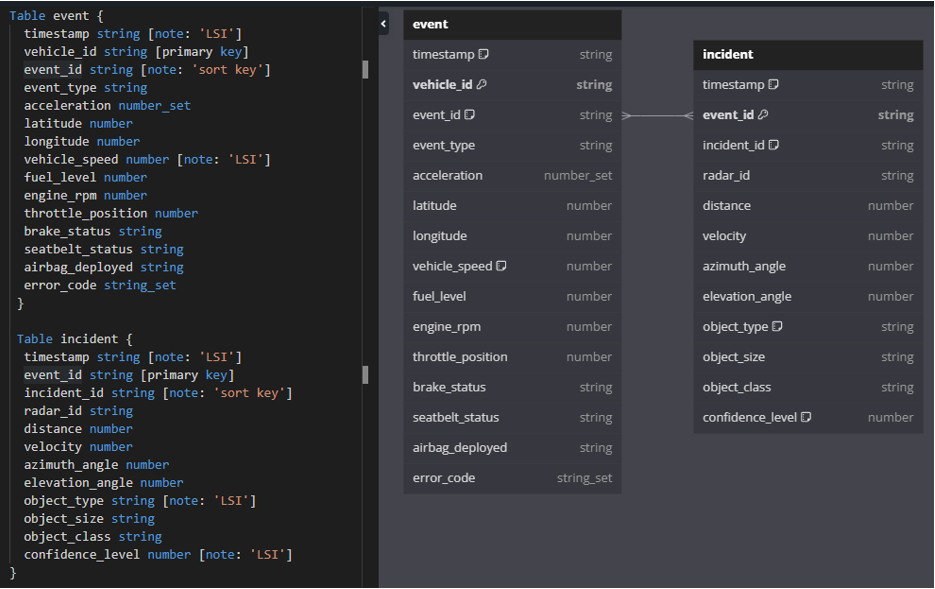

# DynamoDB EDR Sensor Data

## Project Overview

This project involves conducting a research study to explore the best practices for organizing data in DynamoDB tables to achieve optimal performance, particularly when dealing with large volumes of complex sensor data. The project simulates data collected from Event Data Recorders (EDRs) in vehicles, commonly referred to as "black boxes," along with supplementary radar sensor data. The goal is to design and implement efficient DynamoDB schemas, data management functions, and query mechanisms for handling this data.

## Key Features

1. **Data Modeling Research**: Documented various DynamoDB data modeling techniques including Entity-Attribute-Value (EAV), hierarchical structures, normalization/denormalization, and composite key strategies.
   
2. **Schema Design & CloudFormation**: Designed and implemented DynamoDB table schemas optimized for handling EDR and radar data with a focus on query efficiency, data access patterns, and scalability. The schema is included as a CloudFormation template.

3. **Data Simulation Functions**: Implemented functions to generate and delete synthetic data representing.

4. **Accident Analysis**: Developed a function to analyze and extract relevant accident data from radar and EDR events, filtering out only the critical records (e.g., vehicles, pedestrians, cyclists) with high detection confidence.

5. **Indexing Strategies**: Investigated and compared various indexing strategies (GSI, LSI, composite keys) and included optimized querying methods using both scans and queries.

## DynamoDB Schema Design

The project uses a denormalized data structure optimized for efficient querying of EDR and radar data:

- **Primary Table: `VehicleEvents`**
  - **Partition Key**: `vehicle_id`
  - **Sort Key**: `event_type#timestamp`
  - **Attributes**: Event metadata (acceleration, location, vehicle speed, etc.)
  - **Radar Data**: Nested attribute containing up to 800 radar records for each event.

### Diagram

 (Include the diagram showing table structure and relationships)

## CloudFormation Template

The DynamoDB table configuration and associated resources (like GSIs) are defined in the `cloudformation/dynamodb_template.yaml` file. This allows easy deployment and modification of the schema.
